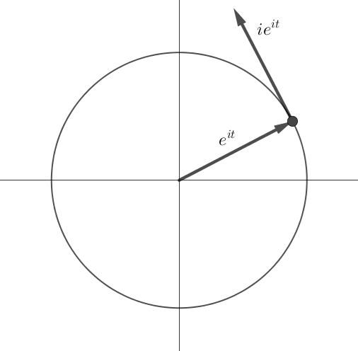
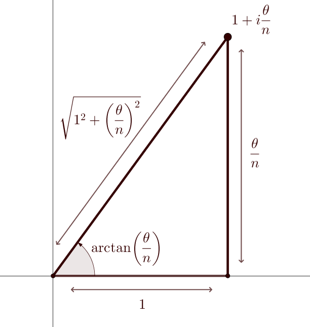

Tout cours sur les nombres complexes qui se respecte vous dira que, étant donné un réel $\theta$, on définit $e^{i\theta}$ de la manière suivante :
$$
e^{i\theta} = \cos(\theta) + i\sin(\theta)
$$
Cependant, au moment de poser cette emblématique définition, on omet souvent de répondre à cette simple question :

... Pourquoi ?

Au-delà l'imparable - et extrêmement frustrant - "parce que ça nous arrange bien", il existe en réalité de très bonnes raisons de choisir cette définition plutôt qu'une autre. De bonnes raisons qui mettent en jeu certaines propriétés fondamentales de l'exponentielle, et sont l'occasion d'explorer différentes facettes de cette fonction si particulière.

Historiquement, c'est Euler qui énonça pour la première fois cette formule en 1748, dans son [Introduction à l'Analyse infinitésimale](https://gallica.bnf.fr/ark:/12148/bpt6k3884z/f125.item), en l'écrivant dans ces termes :

![[img_euler.png | center]]

Il dériva cette formule par des calculs de limites, en utilisant la formule de Moivre et le fait que $e^x = \underset{n\to +\infty}{\lim} \left( 1+ \frac{x}{n} \right)^n$. Cependant, même si Euler fut le premier à énoncer cette formule dans sa forme moderne, elle avait en fait déjà été découverte sous une forme équivalente en 1714 par le mathématicien anglais Roger Cotes.

Ci-dessous, on présente trois justifications possibles pour cette formule : une géométrique, une analytique, et une algébrique. Une fois la définition de $e^{i\theta}$ copieusement justifiée, on en profitera ensuite pour définir $e^z$ pour tout $z\in \mathbb{C}$ et aborder quelques propriétés de cette exponentielle complexe, avant finalement de plonger dans des considérations plus approfondies autour des concepts de fonctions holomorphes et de prolongement analytique.

## 3 bonnes raisons
### Via un peu de géométrie

Il s'agit là peut-être de l'approche la plus élégante, et en tout cas certainement la plus rapide. Imaginons que la quantité $e^{i\theta}$ fasse sens, quel que soit $\theta\in \mathbb{R}$, et vérifie des propriétés similaires à celles de l'exponentielle réelle (ce serait quand même la moindre des choses ... on est en train de chercher à étendre l'exponentielle réelle à un nouveau type de nombres, mais on ne va quand même pas faire cette extension n'importe comment !).\
On cherche à déterminer à quel point du plan complexe correspond cet hypothétique $e^{i\theta}$.

L'idée est alors la suivante : au lieu de chercher directement à localiser le point du plan complexe associé à $e^{i\theta}$, on a va à la place étudier un *chemin* menant à ce point. Plus précisément, on va poser la fonction suivante :
$$
\forall t\in [0,\theta], \quad f(t)=e^{it}
$$
(si $\theta<0$, on remplace $[0,\theta]$ par $[\theta, 0]$)

Quand $t$ varie de 0 à $\theta$, $f(t)$ trace un chemin dans le plan complexe, allant de $f(0)=1$ (dont on connait bien la position !) à $f(\theta)= e^{i\theta}$. Si l'on comprend la forme de ce chemin, on saura alors où il arrive, et donc où placer $e^{i\theta}$.

Avantage de raisonner sur une fonction plutôt que juste sur un point : on peut la dériver ! (ce qui n'est pas sans rappeler [[somme-alt#^648def|une astuce similaire vue dans une autre démonstration]] ...)\
Toujours en supposant que $e^{it}$ existe bien pout tout $t\in \mathbb{R}$, et vérifie des propriétés similaires à l'exponentielle réelle, y compris en matière de dérivation, il faudrait alors avoir :
$$
\forall t\in [0,\theta], \quad f'(t)=ie^{it}=if(t)
$$
Or, multiplier par $i$, cela a pour effet d'effectuer une rotation de $\frac{\pi}{2}$ dans le plan complexe. Cela signifie que, en tout point du chemin décrit par $f$, la vitesse de déplacement est orthogonale à la position. Cela est caractéristique d'un cercle !

<!--

-->

![[img_expo_complexe.png| center]]

Quand $t$ varie de $0$ à $\theta$, $f(t)$ parcourt donc le cercle de centre 0 et de rayon 1 - notre bon vieux cercle trigonométrique. On peut même être encore plus précis : puisque $f(t)$ appartient au cercle trigonométrique pour tout t, on a
$$
\forall t\in [0,\theta], \quad |f'(t)|= |if(t)| = |f(t)| = 1
$$
On est donc en train de parcourir ce cercle à une vitesse constante égale à 1. Par conséquent, au bout d'un temps $\theta$, on a parcouru une distance de $\theta$ sur le cercle trigonométrique : par définition des radians, on est donc arrivé au point du cercle associé à l'angle $\theta$. Ainsi, l'extrémité de notre chemin, $e^{i\theta}$, est le point du cercle trigonométrique associé à l'angle $\theta$, en d'autres termes :
$$
e^{i\theta} = \cos(\theta) + i\sin(\theta).
$$

Cette idée est joliment animée dans une [courte vidéo de 3Blue1Brown](https://www.youtube.com/watch?v=v0YEaeIClKY).

### Via un peu d'analyse

Si vous trouvez l'approche précédente peu rigoureuse, voici une autre approche plus technique mais plus précise.

Il existe une autre façon de définir l'exponentielle, moins couramment utilisée, consistant à la définir comme la limite suivante :

> [!thm] Proposition
> $$
> \forall x\in \mathbb{R}, \quad e^x = \lim_{ n \to \infty } \left( 1+ \dfrac{x}{n} \right)^n.
> $$

> [!dem]- Démonstration
> C'est évident pour $x=0$. Pour $x\neq 0$, on passe sous forme exponentielle :
> $$
> \left( 1+ \dfrac{x}{n} \right)^n = e^{n \ln\left( 1+ \frac{x}{n} \right)} = e^{x  \frac{\ln\left( 1+ \frac{x}{n} \right)}{\frac{x}{n}}}
> $$
> et en utilisant la limite usuelle $\dfrac{\ln(1+u)}{u} \underset{u\to 0}{\longrightarrow} 1$ et la continuité de l'exponentielle, on obtient le résultat souhaité.

Dès lors, il parait naturel de chercher à définir $e^{i\theta}$ de façon analogue, en posant par définition :
$$
e^{i\theta} = \lim_{ n \to \infty } \left( 1+ i\dfrac{\theta}{n} \right)^n.
$$
Pour comprendre ce que vaut $e^{i\theta}$ avec une telle définition, il faut donc déterminer la limite de la suite de nombres complexes $u_n = \left( 1+ i\dfrac{\theta}{n} \right)^n$. Si $\theta=0$, c'est facile (la suite est constante égale à 1 ... donc tend vers 1). En revanche, si $\theta\neq 0$, trouver cette limite n'est *a priori* pas évident ! Heureusement, on peut décomposer le problème en deux problèmes plus simples : on va étudier séparément le module $|u_n|$ et un argument $\arg(u_n)$ de cette suite.

Pour cela, commençons par constater que, par calcul ou par lecture graphique sur le dessin ci-dessous, on a :
- $\left| 1+ i\dfrac{\theta}{n} \right| = \sqrt{ 1+ \dfrac{\theta^{2}}{n^{2}}}$
- $\arg\left( 1+ i\dfrac{\theta}{n} \right) = \arctan\left( \dfrac{\theta}{n} \right)$.

<!--

-->

![[img_expo_complexe_polaire.png| center]]

#### Étude du module

En passant sous forme exponentielle :
$$
\left|\left( 1+ i\dfrac{\theta}{n} \right)^n\right| = \left| 1+ i\dfrac{\theta}{n} \right|^n = \left(\sqrt{ 1+ \dfrac{\theta^{2}}{n^{2}}} \right)^n = e^{n \ln \sqrt{ 1+ \frac{\theta^{2}}{n^{2}}}}
$$
On peut alors faire apparaître la limite usuelle $\dfrac{\ln(1+u)}{u} \underset{u\to 0}{\longrightarrow} 1$ :
$$
e^{n \ln \sqrt{ 1+ \frac{\theta^{2}}{n^{2}}}} = e^{ \frac{1}{2} n \ln \left( 1+ \frac{\theta^{2}}{n^{2}}\right) } = e^{ \frac{\theta^{2}}{2n} \times \frac{\ln \left( 1+ \frac{\theta^{2}}{n^{2}}\right)}{\frac{\theta^{2}}{n^{2}}} } \ \underset{n\to +\infty}{\longrightarrow} \ e^{0\times 1} =1.
$$
#### Étude d'un argument

Puisque $\arctan\left( \dfrac{\theta}{n} \right)$ est un argument de $1+ i\dfrac{\theta}{n}$, on en déduit que $n\arctan\left( \dfrac{\theta}{n} \right)$ est un argument de $\left( 1+ i\dfrac{\theta}{n} \right)^n$. Or, en utilisant la limite usuelle $\dfrac{\arctan(u)}{u} \underset{u\to 0}{\longrightarrow} 1$, on a :
$$
n\arctan\left( \dfrac{\theta}{n} \right) = \theta \times \dfrac{\arctan\left( \frac{\theta}{n} \right)}{\frac{\theta}{n}} \ \underset{n\to +\infty}{\longrightarrow} \ \theta.
$$

#### Conclusion

Ainsi on a montré que $|u_n| \ \underset{n\to +\infty}{\longrightarrow} \ 1$  et que $\arg(u_n) \ \underset{n\to +\infty}{\longrightarrow} \ \theta$. La suite $(u_n)$ converge donc vers le complexe de module 1 et d'argument $\theta$ ... qui n'est autre que $\cos(\theta) + i\sin(\theta)$ !

Avec cette définition, on retrouve ainsi bien le fait que la "bonne" façon de définir $e^{i\theta}$ - ou en tout cas, la façon la plus compatible avec cette définition particulière de l'exponentielle - consiste à poser que $e^{i\theta} = \cos(\theta) + i\sin(\theta)$.

### Via un peu d'algèbre

Une troisième façon de procéder consiste à plonger plus profondément dans les propriétés algébriques de $\mathbb{R}$ et de $\mathbb{C}$, et à prendre du recul sur une propriété clé de l'exponentielle : le fait qu'elle transforme les sommes en produits ($e^{x+y}=e^x e^y$).

Pour en savoir plus, je vous renvoie à la magnifique [vidéo de 3Blue1Brown](https://www.youtube.com/watch?v=mvmuCPvRoWQ) à ce sujet.

## Vers l'exponentielle complexe

A présent que l'on a donné du sens à $e^{i\theta}$ pour $\theta\in \mathbb{R}$, se pose une autre inévitable question : peut-on faire de même pour $e^z$ quel que soit $z\in \mathbb{C}$, et ainsi créer une fonction exponentielle allant de $\mathbb{C}$ dans $\mathbb{C}$, ayant des propriétés similaires à l'exponentielle réelle ?

La réponse est oui ; en fait, on a déjà fait le plus dur du travail ! En effet, étant donné $z=a+ib$, la seule façon "naturelle" de définir $e^z$, pour respecter le fait qu'elle transforme les sommes en produits, est de poser :
$$
e^z = e^a e^{ib}
$$
où $e^a$ est l'exponentielle d'un réel, donc bien définie, et $e^{ib}$ vaut $\cos(b)+i\sin(b)$.

En d'autres termes, on définit l'exponentielle complexe par :

> [!def] Définition
> $$
> \forall a,b\in \mathbb{R}, \quad e^{a+ib} = e^a ( \cos b + i \sin b ).
> $$

On a ainsi défini une fonction $\exp : \mathbb{C} \to \mathbb{C}$ qui étend l'exponentielle réelle $\exp : \mathbb{R} \to \mathbb{R}$ (par là, on entend que ces deux fonctions coïncident sur les réels - ce qui justifier de les appeler et de les noter de la même façon, d'ailleurs).

#### Visualisation de l'effet de l'exponentielle complexe

Pour comprendre l'effet de l'exponentielle complexe sur le plan complexe, il est très utile de remarque que $e^a e^{ib}$ est en fait écrit sous forme exponentielle : il s'agit du nombre de module $e^a$ et d'argument $b$. Par conséquent :
- Si $a$ est constant et $b$ varie, $e^a e^{ib}$ décrit le cercle de centre 0 et de rayon $e^a$. L'exponentielle complexe envoie donc les droites verticales ($a=\text{constante}$) sur des cercles concentriques centrés en 0.
- Si $b$ est constant et $a$ varie, $e^a e^{ib}$ décrit une demi-droite partant de 0 et formée de tous les points d'argument $b$. L'exponentielle complexe envoie donc les droites horizontales ($b=\text{constante}$) sur les demi-droites partant de l'origine du plan.

Cet effet est superbement animé à la [fin de cette vidéo de 3Blue1Brown](https://youtu.be/mvmuCPvRoWQ?t=1428) :

<iframe width="560" height="315" src="https://www.youtube.com/embed/mvmuCPvRoWQ?si=TKEV6J_JHbUBN4ik&amp;start=1428" title="YouTube video player" frameborder="0" allow="accelerometer; autoplay; clipboard-write; encrypted-media; gyroscope; picture-in-picture; web-share" referrerpolicy="strict-origin-when-cross-origin" allowfullscreen></iframe>

## Généralisation : la notion de prolongement analytique

Dans ce qui précède, on a pris une fonction de $\mathbb{R}$ dans $\mathbb{R}$ (l'exponentielle), et on en a cherché un *prolongement* sur $\mathbb{C}$, c'est-à-dire une fonction définie sur $\mathbb{C}$ et coïncidant sur $\mathbb{R}$ avec la fonction initiale.\
Prendre une fonction définie sur un petit ensemble, et chercher à l'étendre sur un ensemble plus grand, c'est un problème qui revient fréquemment en Mathématiques ; et comme on l'a vu, c'est généralement loin d'être trivial à effectuer, en tout cas si l'on veut que le prolongement soit "sympathique". Rien n'empêcherait en effet a priori de prolonger l'exponentielle réelle sur $\mathbb{C}$ en décrétant qu'elle vaut 0 sur tous les éléments de $\mathbb{C}\setminus \mathbb{R}$ ... mais la fonction ainsi obtenue n'aurait pas grand intérêt !

Quand on cherche à effectuer le prolongement d'une fonction sur un ensemble plus grand, on cherche généralement à imposer un certain nombre de contraintes à ce prolongement, à demander qu'il possède toujours un certain nombre des "bonnes propriétés" de la fonction initiale. Ces contraintes peuvent être de différentes natures : ainsi, quand on cherchait plus haut à donner un sens à $e^{i\theta}$, chacune des 3 approches que nous avons présentées cherchait à préserver une certaine propriété de l'exponentielle réelle.
- l'approche géométrique cherchait à préserver le fait que la dérivée de l'exponentielle est égale à elle-même ;
- l'approche analytique cherchait à préserver l'identité $e^x = \underset{n\to +\infty}{\lim} \left(  1+\frac{x}{n} \right)^n$ ;
- l'approche algébrique cherchait à préserver la propriété $e^{x+y} = e^x e^y$.

Tout cela peut sembler un peu arbitraire - et ça l'est : pourquoi chercher à préserver telle propriété et pas telle autre ? Il n'y a pas vraiment de bonne réponse à cette question ; le principal, dans notre cas avec l'exponentielle, c'était de préserver une propriété suffisamment forte pour que toutes les autres en découlent. En l'occurrence, comme on l'a vu, les trois chemins menaient à la même destination, car ces différentes propriétés sont [essentiellement équivalentes les unes aux autres](https://en.wikipedia.org/wiki/Characterizations_of_the_exponential_function).

En fait, en analyse, quand on cherche à prolonger une fonction, la condition la plus fréquente que l'on impose est une condition de *régularité* : on demande que le prolongement soit continu/dérivable/de classe $C^\infty$/... (choisissez votre niveau de régularité préféré). Dans le cas de l'exponentielle, qui est dérivable sur $\mathbb{R}$, il paraîtrait par exemple raisonnable de demander que son prolongement à $\mathbb{C}$ soit également dérivable - on parle de fonction *holomorphe*.

> [!def] Définition
> On dit qu'une fonction $f:\mathbb{C} \to \mathbb{C}$ est *holomorphe* si elle est dérivable au sens complexe en tout point de $\mathbb{C}$, c'est-à-dire si, pour tout $z_0 \in \mathbb{C}$, il existe $\ell\in \mathbb{C}$ tel que
> $$
> \dfrac{f(z)-f(z_0)}{z-z_0} \ \underset{z\to z_0}{\longrightarrow} \ \ell.
> $$

> [!rem]- Remarque : limite au sens complexe
> La notion de limite sur $\mathbb{C}$ se définit de façon similaire à celle sur $\mathbb{R}$ : ainsi, la définition ci-dessus signifie que
> $$
> \forall \varepsilon>0, \exists \alpha >0 \text{ tq } \forall z\in \mathbb{C}, \ \text{si } |z-z_{0}|<\alpha \text{ alors } \left| \dfrac{f(z)-f(z_0)}{z-z_0} - \ell \right| < \varepsilon.
> $$

Le fait pour une fonction d'être holomorphe est en réalité très contraignant, bien plus que le fait d'être dérivable pour une fonction de $\mathbb{R}$ dans $\mathbb{R}$ ; par exemple, une fonction holomorphe sur $\mathbb{C}$ est automatiquement infiniment dérivable sur $\mathbb{C}$ (alors qu'une fonction dérivable sur $\mathbb{R}$ n'a aucune raison n'être forcément de classe $C^\infty$) ! Cela fait des fonctions holomorphes des fonctions très sympathiques, avec beaucoup de bonnes propriétés.

Dans le reste de cette page, on va s'intéresser exclusivement à ce type de prolongement, ce que l'on appelle un *prolongement analytique*. Étant donnée une fonction $f:\mathbb{R}\to \mathbb{R}$ dérivable sur $\mathbb{R}$, on va donc s'interroger sur la possibilité de prolonger $f$ en une fonction holomorphe $f : \mathbb{C} \to \mathbb{C}$, en se posant deux questions :
- à quelle condition un tel prolongement existe-t-il ?
- si un tel prolongement existe, est-il unique ?

> [!warning] Un avertissement de rigueur
> Par souci de simplicité - et car le but ici n'est pas non plus de faire un cours complet d'analyse complexe ! - on s'intéresse ici seulement à des fonctions holomorphes sur $\mathbb{C}$ *tout entier*, ce que l'on appelle des *fonctions entières*.\
> Les fonctions holomorphes définies seulement sur une partie de $\mathbb{C}$ ont un comportement plus compliqué, dont nous allons donc soigneusement éviter de parler.
> En particulier, tous les résultats énoncés ci-dessous ne sont que des cas particuliers de résultats plus généraux ... et plus pénibles à énoncer. L'espoir est, avec ce choix, de rendre la suite de cette page plus accessible, tout en donnant néanmoins une bonne idée des belles propriétés que satisfont les fonctions holomorphes.

### Un résultat préliminaire

On va commencer par un résultat fondamental que l'on ne cherchera pas à démontrer, la démonstration étant très loin d'être évidente. Il énonce que les fonctions holomorphes sur $\mathbb{C}$ tout entier (ce que l'on appelle des fonctions *entières*) sont en fait d'une forme très particulière.

>[!thm] Théorème (forme des fonctions entières)
>Soit $f$ une fonction définie sur $\mathbb{C}$ tout entier. Alors $f$ est holomorphe si et seulement si il existe des complexes $a_0$, $a_1$, $a_2$, ... tels que 
>$$
>\forall z\in \mathbb{C}, \quad \sum_{k=0}^{n} a_k z^k \ \underset{n\to +\infty}{\longrightarrow} \ f(z).
>$$
>Autrement dit, les fonctions holomorphes sur $\mathbb{C}$ tout entier sont exactement les fonctions de la forme :
>$$
> \forall z\in \mathbb{C}, \quad f(z)= \sum_{k=0}^{+\infty}a_k z^k.
> $$
> Mieux : dans cette écriture, les $a_k$ sont uniquement déterminés : si $f$ s'écrit sous cette forme, on a nécessairement $a_k = \frac{f^{(k)}(0)}{k!}$. Ainsi une fonction entière s'écrit toujours sous la forme :
> $$
> \forall z\in \mathbb{C}, \quad f(z)= \sum_{k=0}^{+\infty} \dfrac{f^{(k)}(0)}{k!}z^k.
> $$

^thm-fonctions-entieres

<!--
> [!thm] Corollaire
> Soit $f$ une fonction entière. Alors, pour tout $a\in \mathbb{C}$, on a :
> $$
> \forall z\in \mathbb{C}, \quad f(z)= \sum_{k=0}^{+\infty}\dfrac{f^{(k)}(a)}{k!} (z-a)^k.
> $$

> [!dem] Démonstration
> Il s'agit essentiellement d'appliquer le théorème précédent et de faire un changement de variable.\
> Considérons la fonction $g : z\mapsto f(a+z)$.  Cette fonction est holomorphe sur $\mathbb{C}$ (car $f$ l'est), et pour tout $k\in \mathbb{N}$, $g^{k}(z) = f^{k}(a+z)$. En particulier, $g^{(k)}(0) = f^{(k)}(a)$.
> Le théorème précédent, appliqué à $g$, donne alors :
> $$
> \forall z\in \mathbb{C}, \quad g(z)= \sum_{k=0}^{+\infty} \dfrac{g^{(k)}(0)}{k!}z^k = \sum_{k=0}^{+\infty} \dfrac{f^{(k)}(a)}{k!}z^k.
> $$
> En remplaçant $z$ par $z-a$, on obtient alors la formule souhaitée (puisque $g(z-a)=f(z)$).

-->

### Unicité du prolongement

Commençons par régler la question de l'unicité à l'aide du résultat suivant, parfois appelé "Principe du prolongement analytique" ou "Théorème d'identité" :

<!--
est une conséquence d'un autre résultat, le *principe des zéros isolés*.
-->

<!--

> [!thm] Théorème (unicité du prolongement)
> Soient $f, g: \mathbb{C} \to \mathbb{C}$ deux fonctions holomorphes.\
> On suppose qu'il existe une suite $(z_n)$ de complexes deux à deux distincts, **convergente**, telle que $f(z_n)=g(z_n)$ pour tout $n\in \mathbb{N}$.\
> Alors $f=g$.
> 
> En particulier, si $f, g$ sont deux fonctions holomorphes de $\mathbb{C}$ dans $\mathbb{C}$ qui coïncident sur $\mathbb{R}$, alors $f=g$.

> [!dem] Démonstration
> Commençons par simplifier le problème : posons $h=g-f$. Alors $h$ est une fonction holomorphe sur $\mathbb{C}$ telle que $h(z_n)=g(z_n)-f(z_n)=0$ pour tout $n\in \mathbb{N}$, et le but devient de prouver que $h$ est la fonction nulle.
> 
> 

-->

> [!thm] Théorème (unicité du prolongement)
> Soient $f, g: \mathbb{C} \to \mathbb{C}$ deux fonctions holomorphes qui coïncident sur $\mathbb{R}$, i.e. telles que $f(x)=g(x)$ pour tout $x\in \mathbb{R}$.\
> Alors $f=g$.

> [!dem]- Démonstration
> Commençons par simplifier le problème : posons $h=g-f$. Alors $h$ est une fonction holomorphe sur $\mathbb{C}$ telle que $h$ s'annule en tout point de $\mathbb{R}$, et le but devient de prouver que $h$ est la fonction nulle.
> 
> D'après le [[expo-complexe#^thm-fonctions-entieres|théorème énoncé plus haut]], puisque $h$ est holomorphe sur $\mathbb{C}$ tout entier, il existe des complexes $a_0$, $a_1$, $a_2$, ... tels que 
>$$
>\forall z\in \mathbb{C}, \quad h(z) = \sum_{k=0}^{+\infty} a_k z^k.
>$$
>Il y a alors deux cas de figure possibles :
>- soit tous les $a_k$ sont nuls. Dans ce cas, $h(z)$ est bien nulle pour tout $z\in \mathbb{C}$ comme souhaité.
>- soit au moins un des $a_k$ est non-nul ; on va  montrer que cela n'est pas possible. Pour cela, on va factoriser, dans l'expression de $h$, la plus grande puissance de $z$ possible, comme on le ferait pour un polynôme : en notant $m$ le plus petit indice pour lequel $a_{m}\neq 0$, on a
>$$
>\begin{align*}
>\forall z\in \mathbb{C}, \quad h(z) = \sum_{k=m}^{+\infty} a_k z^k &= a_m z^m + a_{m+1} z^{m+1} + a_{m+2} z^{m+2} + \ldots \\
> &= z^{m} \left( a_m + a_{m+1} z + a_{m+2} z^{2} + \ldots \right)\\
> &= z^m Q(z)
> \end{align*}
>$$
>avec $Q(z)= a_m + a_{m+1} z + a_{m+2} z^{2} + \ldots$.\
>La fonction $Q$ est continue (car holomorphe), et $Q(0)=a_m \neq 0$ ; par conséquent, au voisinage de 0, la fonction $Q$ ne s'annule pas. Mais cela entraîne que, pour $z\neq 0$ très proche de 0, $h(z)=z^m Q(z)$ ne s'annule pas non plus ; c'est absurde puisque par hypothèse $h$ doit s'annuler sur $\mathbb{R}$ tout entier.
>
>Ainsi, le second cas étant impossible, on est forcément dans le premier cas : on a donc $h=0$, i.e. $f=g$.

 
Ainsi, on a démontré l'unicité d'un prolongement analytique sur $\mathbb{C}$, sous couvert de son existence :
 si une fonction $f:\mathbb{R}\to \mathbb{R}$ peut se prolonger en une fonction holomorphe $f:\mathbb{C}\to \mathbb{C}$, alors ce prolongement est **unique** !

### Existence d'un prolongement

Les choses se passent moins bien pour la question de l'existence car, comme on l'a vu, être holomorphe sur $\mathbb{C}$ est une condition assez contraignante, beaucoup plus que d'être dérivable sur $\mathbb{R}$. Plus précisément, le [[expo-complexe#^thm-fonctions-entieres|théorème vu plus haut]] entraîne le critère suivant :

> [!thm] Théorème (critère de prolongement)
> Soit $f:\mathbb{R}\to \mathbb{R}$. Alors $f$ s'étend en une fonction holomorphe de $\mathbb{C}$ de $\mathbb{C}$ si et seulement si :
> 1. $f$ est indéfiniment dérivable en 0 ;
> 2. La *série de Taylor* de $f$ converge vers $f$ sur $\mathbb{R}$ tout entier, i.e. :
> $$
> \forall x \in \mathbb{R}, \quad \sum_{k=0}^{n} \dfrac{f^{(k)}(0)}{k!}x^k \ \underset{n\to +\infty}{\longrightarrow} \ f(x).
> $$
> Autrement dit, les fonctions de $\mathbb{R}$ dans $\mathbb{R}$ pouvant être étendues en une fonction holomorphe de $\mathbb{C}$ dans $\mathbb{C}$ sont exactement les fonctions pouvant s'écrire sous la forme :
> $$
> \forall x\in \mathbb{R}, \quad f(x) = \sum_{k=0}^{+\infty}a_k x^k,
> $$
> où les $a_k$ sont des coefficients réels.
> 
> Lorsque cette condition est vérifiée, il n'existe alors qu'une seule manière de prolonger $f$ en une fonction holomorphe de $\mathbb{C}$ dans $\mathbb{C}$ ; il s'agit de la fonction définie par :
> $$
> \forall z\in \mathbb{C}, \quad f(z) = \sum_{k=0}^{+\infty}a_k z^k.
> $$

^thm-critere-prolongement

**Deux exemples**
- L'exponentielle réelle [[somme-expo#^7e582b |peut se mettre]] sous une telle forme :
$$
\forall x\in \mathbb{R}, \quad e^x = \sum_{k=0}^{+\infty} \dfrac{x^{k}}{k!}
$$
Il existe donc une (unique) manière de prolonger l'exponentielle réelle en une fonction holomorphe $\exp : \mathbb{C} \to \mathbb{C}$, en posant :
$$
\forall z\in \mathbb{C}, \quad e^z = \sum_{k=0}^{+\infty} \dfrac{z^{k}}{k!}.
$$
On peut faire de même avec les fonctions cosinus et sinus, puisque celles-ci admettent des [[somme-expo#^thm-DSE-cos|écritures similaires]], et ainsi donner un sens à $\cos(z)$ et $\sin(z)$ pour tout $z\in \mathbb{C}$ :
$$
 \forall z\in \mathbb{C}, \quad \cos(z) = \sum_{k=0}^{+\infty} \dfrac{(-1)^k z^{2k}}{(2k)!} \quad \text{et} \quad \sin(z) = \sum_{k=0}^{+\infty} \dfrac{(-1)^k z^{2k+1}}{(2k+1)!}.
 $$

- Soit $f: x\mapsto \dfrac{1}{1+x^2}$. On remarque que, pour tout $x\in ]-1,1[$,
$$
\sum_{k=0}^{n} (-1)^k x^{2k} = \sum_{k=0}^{n} (-x^2)^k = \dfrac{1-(-x^2)^{n+1}}{1-(-x^2)} \ \underset{n\to +\infty}{\longrightarrow} \ \dfrac{1}{1+x^2}. 
$$
On a donc :
$$
\forall x\in ]-1,1[, \quad f(x)=\sum_{k=0}^{+\infty} (-1)^k x^{2k}.
$$
Cependant cette égalité ne tient plus pour $x\notin ]-1,1[$, car la somme ne converge plus (par exemple, pour $x=1$, la somme devient $1-1+1-1+1-1+\ldots$ qui n'est pas définie).\
Par conséquent, même si $f$ est une sympathique fonction de classe $C^{\infty}$ sur $\mathbb{R}$, il est impossible de la prolonger en une fonction holomorphe de $\mathbb{C}$ dans $\mathbb{C}$.

> [!rem]- Remarque
> Dans ce second exemple, il est en fait tout à fait possible de prolonger $f$ de façon holomorphe sur un *voisinage* de $\mathbb{R}$ dans $\mathbb{C}$ - plus précisément, si l'on considère le "tube de rayon 1" autour de $\mathbb{R}$ (i.e. l'ensemble des complexes $a+ib$ tels que $-1<b<1$), alors on peut prolonger $f$ sur ce tube en posant simplement :
> $$
> f(z)= \dfrac{1}{1+z^2}.
> $$
> Cependant, on ne peut pas augmenter davantage le rayon de ce tube ; la racine du problème tient au fait que la quantité $\dfrac{1}{1+z^2}$ n'est pas définie en $i$ et $-i$. Le fait que ces deux points problématiques soient à distance 1 de l'origine est ce qui explique pourquoi la série $\displaystyle \sum_{k=0}^{+\infty} (-1)^k x^{2k}$ ne converge plus pour $|x|\geq 1$.
> 
> [Cette discussion](https://math.stackexchange.com/questions/2539520/power-series-representation-of-arctangent-fails-to-converge-everywhere) développe un peu plus le sujet.

#### Une condition suffisante de prolongement

Le [[expo-complexe#^thm-critere-prolongement|critère précédent]] est intéressant mais peu facile à manipuler, car il n'est pas aisé de tester si l'on a bien $\displaystyle\sum_{k=0}^{n} \dfrac{f^{(k)}(0)}{k!}x^k \ \underset{n\to +\infty}{\longrightarrow} \ f(x).$

On peut néanmoins souvent lui substituer ce résultat plus faible mais plus commode, qui donne une condition suffisante pour l'existence d'un prolongement analytique sur $\mathbb{C}$ : pour qu'un tel prolongement existe, il suffit que les dérivées successives de $f$ ne soient "pas trop grosses".

> [!thm] Théorème (condition suffisante de prolongement)
> Soit $f:\mathbb{R}\to \mathbb{R}$. On suppose que :
> 1. $f$ est de classe $C^{\infty}$ sur $\mathbb{R}$.
> 2. Les dérivées successives de $f$ sont uniformément bornées sur tout segment, i.e. :
> $$
> \forall r>0, \ \exists M>0 \text{ tq } \forall n\in \mathbb{N},\  \forall x\in [-r,r], \ |f^{(n)}(x)|\leq M.
> $$
> (notez bien que la constante $M$ est **indépendante de n**.)
> 
> Alors la série de Taylor de $f$ converge vers $f$ sur $\mathbb{R}$ tout entier :
> $$
> \forall x \in \mathbb{R}, \quad \sum_{k=0}^{n} \dfrac{f^{(k)}(0)}{k!}x^k \ \underset{n\to +\infty}{\longrightarrow} \ f(x),
> $$
> et $f$ est donc prolongeable en une fonction holomorphe de $\mathbb{C}$ dans $\mathbb{C}$ en posant :
> $$
> \forall z\in \mathbb{C}, \quad \displaystyle f(z)=\sum_{k=0}^{+\infty} \dfrac{f^{(k)}(0)}{k!}z^k.
> $$

> [!dem] Démonstration
> C'est une conséquence directe de [[somme-expo#^thm-condition-DSE|cet autre résultat]].

